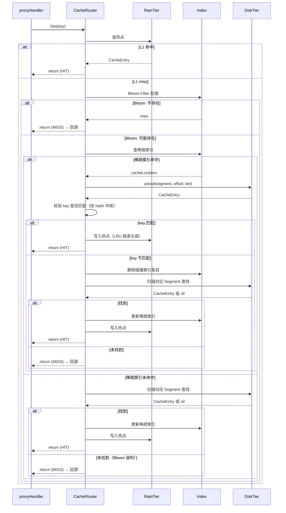
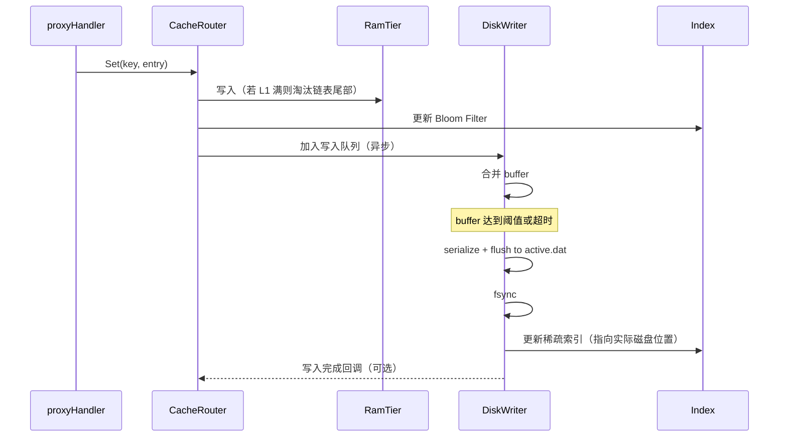
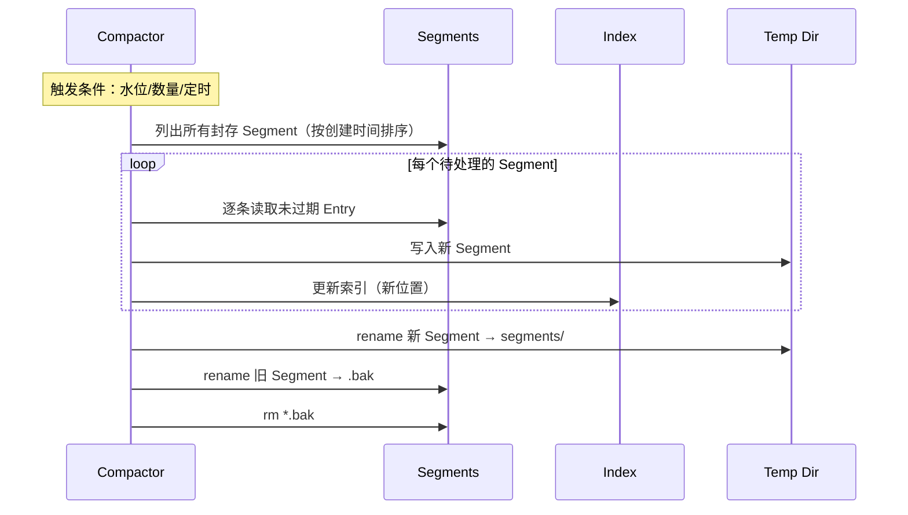
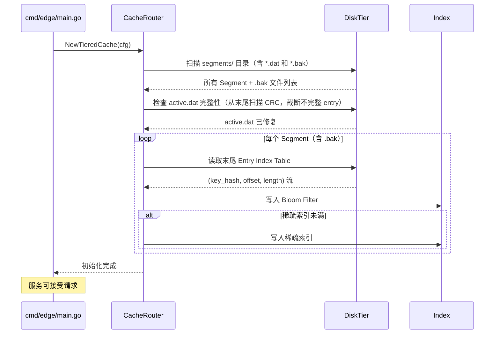

# Edge 节点两级磁盘缓存架构设计

**版本**: v1.0
**日期**: 2026-05-14
**状态**: 草稿

---

## 1. 实现方案概述

### 1.1 目标

为 Veer Edge 节点增加**磁盘持久化缓存层**，使缓存容量从内存限制（默认 512MB）扩展到 TB 级，且进程重启后缓存不丢失。

### 1.2 现状

当前 `MemoryCache`（`edge/cache.go`）为纯内存缓存：
- `map[string]*CacheEntry` 全量索引
- 按 `CachedAt` 淘汰最旧条目（O(n) 扫描）
- **无磁盘持久化**，重启即丢失
- 容量受限于机器内存

### 1.3 核心技术方案

| 维度 | 方案 |
|------|------|
| **缓存层级** | 两级：RAM（L1 热点） + Disk（L2 温冷） |
| **磁盘格式** | 分段 append-only 文件（Segment） |
| **索引架构** | RAM Bloom Filter（快速判 miss）+ 稀疏索引（定位磁盘） |
| **淘汰策略** | L1: LRU / L2: LRU + TTL + 磁盘水位 |
| **碎片处理** | 后台 Compaction goroutine |
| **写策略** | Write-back（L1 优先，异步批刷到 L2） |
| **恢复策略** | 启动时扫描 Segment 列表重建 Bloom Filter（秒级） |

**关键设计决策**：
- **不引入外部依赖**（如 Badger），纯 Go 标准库实现文件 I/O
- **不绕开文件系统**（如 ATS 的 raw disk），使用 OS 文件接口，降低运维复杂度
- Segment 大小按机器配置，SSD 推荐 512MB~2GB，HDD 推荐 256MB~1GB
- 所有缓存参数可配置，每台机器独立调整

---

## 2. 架构总览

```
                        ┌──────────────────┐
                        │   proxyHandler   │
                        └────────┬─────────┘
                                 │
                          ┌──────▼──────┐
                          │  CacheRouter │  ← 统一的 Get/Set 入口
                          └──────┬──────┘
                     ┌───────────┼───────────┐
                     ▼           ▼           ▼
               ┌──────────┐ ┌──────────┐ ┌──────────┐
               │  L1 RAM  │ │  L2 Disk │ │  Origin  │
               │  热点    │ │  温冷    │ │  回源    │
               └──────────┘ └──────────┘ └──────────┘
                     │           │
                     ▼           ▼
               ┌──────────────────────┐
               │    Bloom Filter      │  ← 快速判 miss
               │    + 稀疏索引        │  ← key → (segment, offset, len)
               └──────────────────────┘
```

---

## 3. 磁盘格式设计

### 3.1 目录结构

```
{cache.disk.path}/
├── CACHE_VERSION          # 版本标记（格式不兼容时拒绝加载）
├── segments/
│   ├── active.dat         # 当前写入的分段（append-only）
│   ├── seg_000000001.dat  # 已封存的只读分段
│   ├── seg_000000002.dat
│   └── ...
├── index/
│   └── snapshot.idx       # 索引快照（加速启动，可选）
└── tmp/                   # compaction 临时目录
```

### 3.2 Segment 文件格式

每个 Segment 文件结构：

```
┌─────────────────────────────┐
│       Segment Header        │  ← 64 bytes fixed
│  Magic(4B) | Version(2B)    │
│  CreateTime(8B) | Entries(8B)│
│  DataOffset(8B) | CRC(8B)   │
│  Reserved(26B)              │
├─────────────────────────────┤
│       Entry 1               │
│  ┌───────────────────────┐  │
│  │ EntryHeader (28B)     │  │  ← CRC32(4B) | Status(2B) | BodyLen(4B) | KeyLen(2B) | ExpiresAt(8B) | CachedAt(4B) | ContentTypeLen(2B) | HeadersLen(2B)
│  │ Key (variable)        │  │
│  │ ContentType (variable)│  │
│  │ Headers (variable)    │  │  ← gob 编码的 http.Header
│  │ Body (variable)       │  │
│  └───────────────────────┘  │
│       Entry 2               │
│       ...                   │
│       Entry N               │
├─────────────────────────────┤
│     Entry Index Table       │  ← 每个 entry 的 (key_hash, offset, length) 20B × N
│                             │  ← 用于快速重建索引
│                             │  ← KeyHash(8B) | BodyOffset(8B) | BodyLen(4B)（全 BE uint）
└─────────────────────────────┘
```

**说明**：
- Entry 顺序追加，写入后不再修改
- Entry Index Table 位于文件末尾，写入时先写 entries，最后写索引表
- `ContentType` 和 `Headers` 独立编码，避免反序列化整个 entry 只读头信息

### 3.3 Entry 序列化

```
entry wire format:
  CRC32        [4 bytes]   ← 覆盖整个 entry 的校验
  StatusCode   [2 bytes]   ← HTTP 状态码
  BodyLen      [4 bytes]   ← Body 长度（BE uint32），最大 4GB
  KeyLen       [2 bytes]   ← Key 长度（BE uint16），最大 65535
  ExpiresAt    [8 bytes]   ← UnixNano
  CachedAt     [4 bytes]   ← Unix timestamp（秒精度）
  ContentTypeLen [2 bytes] ← ContentType 长度
  HeadersLen   [2 bytes]   ← gob 编码后的 Headers 长度
  Key          [KeyLen bytes]
  ContentType  [ContentTypeLen bytes]
  Headers      [HeadersLen bytes]  ← gob 编码
  Body         [BodyLen bytes]
```

---

## 4. 索引架构

### 4.1 两层索引

```
                   ┌─────────────────────────┐
                   │   Bloom Filter (RAM)     │  ← 快速过滤不存在的 key
                   │   16 bytes per entry     │
                   │   ~0.1% false positive   │
                   └────────────┬────────────┘
                                │ true (可能存在)
                                ▼
                   ┌─────────────────────────┐
                   │   Sparse Index (RAM)     │  ← key hash → (segment_id, body_offset, body_len, expires_at, cached_at)
                    │   32 bytes per hot entry │
                   │   LRU 限制最大条目数      │
                   │   (可配，默认 1000 万)    │
                   └─────────────────────────┘
                                │ hit → 直接从磁盘读 body
                                │ miss → 回源
```

### 4.2 索引重建（启动时）

```
启动流程：
   1. 遍历 {disk.path}/segments/ 下所有 *.dat 和 *.bak 文件
   2. 对 active.dat：从文件末尾向前扫描，找到最后一个完整 entry（CRC32 校验），
      截断不完整数据；若 active.dat 不存在（crash 后首次启动）则新建
   3. 读取每个文件的 Entry Index Table（文件末尾）
   4. 对每个 entry：(key_hash, offset, length)
      a. 写入 Bloom Filter
      b. 若 entries < sparse_index_max → 写入稀疏索引
   5. 耗时约：1000 万条目 ≈ 3-5 秒（纯顺序读）
```

---

## 5. 组件设计

### 5.1 组件关系

```
┌─────────────────────────────────────────────────────┐
│                    TieredCache                       │
│  ┌──────────┐  ┌──────────┐  ┌───────────────────┐  │
│  │ RamTier   │  │ DiskTier │  │ Background Tasks  │  │
│  │ RWMutex   │  │          │  │                   │  │
│  │+map+list  │  │ ┌──────┐ │  │ ┌──────────────┐ │  │
│  │           │  │ │ Writer│ │  │ │ Compactor    │ │  │
│  │           │  │ │      │ │  │ │ (goroutine)  │ │  │
│  │           │  │ └──────┘ │  │ └──────────────┘ │  │
│  │           │  │ ┌──────┐ │  │ ┌──────────────┐ │  │
│  │           │  │ │ Reader│ │  │ │ Cleaner      │ │  │
│  │           │  │ │      │ │  │ │ (expiry)      │ │  │
│  │           │  │ └──────┘ │  │ └──────────────┘ │  │
│  └──────────┘  └──────────┘  └───────────────────┘  │
│  ┌──────────────────────────────────────────────┐   │
│  │             Index (Bloom + Sparse)            │   │
│  └──────────────────────────────────────────────┘   │
└─────────────────────────────────────────────────────┘
```

### 5.2 CacheRouter（统一入口）

与外部（`proxyHandler`）交互的单一接口：

```go
type CacheRouter struct {
    ramTier   *RamTier
    diskTier  *DiskTier
    index     *CacheIndex
    stats     *CacheStats
}

func (cr *CacheRouter) Get(key string) (*CacheEntry, bool)
func (cr *CacheRouter) Set(key string, entry *CacheEntry)
func (cr *CacheRouter) Delete(key string)
func (cr *CacheRouter) Stats() map[string]interface{}
func (cr *CacheRouter) Stop()
```

**Get 路径**：
1. 查 L1 RAM → hit 则移至 LRU 链表头部，直接返回
2. Bloom Filter 判 miss → 不存在则返回
3. 查稀疏索引 → 不命中则返回
4. 从磁盘对应 Segment 读取 Entry，并校验 key 是否匹配（防 hash 冲突）
5. 读到的 entry 写回 L1 RAM（晋升为热点，若 L1 满则淘汰链表尾部）
6. 返回

**Set 路径**：
1. 写入 L1 RAM（若 L1 满则淘汰链表尾部）
2. 更新 Bloom Filter（概率性结构，提前写入安全）
3. 异步通知 diskTier.Writer（将 entry 序列化后写入 active segment 的 buffer）
4. 稀疏索引仅在 flush 成功后更新（确保索引指向的磁盘位置已有数据）

### 5.3 RamTier（L1）

- 用 `sync.RWMutex` + `map[string]*list.Element` + `container/list` 实现
- 容量：可配（默认 `max_size_mb` 的 5%，最小 64MB，最大 4GB）
- 淘汰：标准 LRU — 新 entry 插入链表头部，淘汰时删除链表尾部；Get 命中时将 entry 移到链表头部（O(1)）
- 写入时同时写入 Buffer 等待刷盘

### 5.4 DiskTier（L2）

#### 5.4.1 Writer

```go
type DiskWriter struct {
    activePath    string
    buf           bytes.Buffer
    bufSize       int64         // 当前 buffer 字节数
    flushAtBytes  int64         // 触发刷盘的阈值
    flushInterval time.Duration // 最大等待时间
    
    mu        sync.Mutex
    isFlushing bool
    entries   []indexEntry  // 待写入的索引条目
}
```

**写入策略**：
- Set 调用时，将 entry 序列化写入 `bytes.Buffer`
- 当 buffer >= `write_buffer_kb` 或距上次刷盘超过 `flush_interval_ms` 时，触发异步 `flush()`
- `flush()`：一次性 `writev`/追加写入 active segment 文件末尾
- 写入成功后更新稀疏索引（指向实际磁盘位置）
- Bloom Filter 在 Set 时已更新，flush 时无需重复
- flush 失败（磁盘满、I/O 错误）时：
  1. 记录错误日志并递增 `write_error` 指标
  2. 标记该批 entry 为"待重试"，返回错误给 CacheRouter
  3. CacheRouter 收到错误后，保持 L1 数据不变（下次 Set 可覆盖），
     索引中保留这些 entry 的旧磁盘位置（如有），直到下一次成功 flush 覆盖
  4. 连续失败超过阈值时触发报警

**Segment 轮转**：
- active segment 达到 `segment_size_mb` 时：
  1. 写入 Entry Index Table 到文件末尾
  2. `fsync` 确保磁盘
  3. 重命名 `active.dat` → `seg_{seq}.dat`
  4. 创建新的 `active.dat`

#### 5.4.2 Reader

```go
type DiskReader struct {
    segments   map[uint64]*segmentInfo  // segment_id → file info
    activePath string
    // segments 从 mmap 或 pread 读
}
```

**读策略**：
- 从稀疏索引拿到 `(segment_id, body_offset, body_len)`
- 使用 `pread` 或 `mmap` 读 entry（含 key）
- 校验读出的 key 与请求的 key 一致（防稀疏索引 hash 冲突）
  - key 匹配 → body 写入 L1，返回
  - key 不匹配 → 删除该稀疏索引条目（碰撞脏数据），降级为扫描整个 Segment 查找正确 entry
- 读到后写入 L1（晋升）

### 5.5 Compactor

```go
type Compactor struct {
    watermark    float64 // 磁盘使用率阈值
    minInterval  time.Duration // 最小执行间隔
    
    mu       sync.Mutex
    running  bool
    stopChan chan struct{}
}
```

**触发条件**（任一满足）：
1. 磁盘使用率 > `compaction.watermark`（默认 85%）
2. 已封存 Segment 数量 > `max_segments`（默认 200）
3. 定期强制执行（默认每 30 分钟）

**执行步骤**：
1. 按 Segment 的 `CreateTime` 排序，从最旧开始扫描
2. 对每个 Segment，逐条读取 Entry
3. 如果 entry 未过期 → 写入新 Segment（temp 目录）
4. 如果已过期 → 跳过（即回收空间）
5. 完成一组后，先 `rename` 新 segment 到正式目录（以 `seg_{seq}.dat` 命名）
6. 再 `rename` 旧 segment 为 `.bak`（此时新旧文件都可访问）
7. 最后删除 `.bak`
8. 更新索引

**崩溃安全性**：步骤 5‑7 中任何一点崩溃都不会导致数据永久丢失：
- 崩溃在步骤 5 前：只有 temp 目录中的临时文件，无害
- 崩溃在步骤 5 后、步骤 6 前：新 segment 已就绪，旧 segment 仍可读
- 崩溃在步骤 6 后、步骤 7 前：新旧数据都存在（`.bak` 在启动时会被扫描）

### 5.6 索引组件

```go
type CacheIndex struct {
    bloom       *bloom.BloomFilter    // 16 bytes per entry
    sparse      *sparseIndex           // hot entries only
    maxSparse   int                    // 稀疏索引上限
}
```

**Bloom Filter**：
- 使用 `github.com/bits-and-blooms/bloom/v3`（如不引入外部依赖，手写 4 轮 murmur3）
- 误判率目标：0.1%
- 全局 Bloom Filter：运行时持续更新（Set 时写入新 entry 的 hash），启动时从所有 Segment 重建
- Segment 内嵌的 Bloom Filter（可选）：Segment 封存时计算，用于加速定点扫描
- 启动时重建全局 Bloom Filter

**稀疏索引**：
- `map[uint64]cacheLocation`（key hash → 位置）
- cacheLocation 32 bytes：
  ```go
  type cacheLocation struct {
      SegmentID  uint64    // 8 bytes
      BodyOffset uint64    // 8 bytes
      BodyLen    uint32    // 4 bytes
      ExpiresAt  int64     // 8 bytes (UnixNano)
      CachedAt   uint32    // 4 bytes (Unix timestamp，精度到秒，uint32 可表示至 2106 年)
  }
  ```
- 使用 `sync.Mutex` + `map[uint64]*list.Element` + `container/list` 实现 LRU 淘汰
- 上限可配（默认 1000 万 entry，结构体 32B + map 内部开销 ≈ 70B/entry，约占 700MB RAM）

---

## 6. 配置设计

### 6.1 配置结构

```yaml
edge:
  cache:
    ttl_seconds: 300
    max_size_mb: 512
    max_l1_mb: 4096                   # L1 最大内存上限（默认 4GB）

    # 磁盘层
    disk:
      enabled: false                    # 默认关闭，打开后启用 L2
      path: "/data/cache/veer"          # 缓存根目录，按机器挂载点调整
      max_size_gb: 500                  # 磁盘容量上限（TB 级按需调整）
      segment_size_mb: 512              # SSD: 512~2048 / HDD: 256~1024
      write_buffer_kb: 4096             # 写入 buffer，SSD 可大 HDD 宜小
      flush_interval_ms: 100            # 最大刷盘间隔

      # 后台维护
      compaction:
        enabled: true
        watermark: 0.85                 # 磁盘使用率触发
        interval_minutes: 30            # 定期执行间隔
        max_segments: 200               # 超过此数量也触发

      # 索引
      index:
        bloom_bits_per_entry: 16        # Bloom Filter 位宽
        sparse_max_entries: 10000000    # 稀疏索引上限（约 320MB RAM）
```

### 6.2 配置结构体

```go
// config/types.go 新增

type EdgeDiskCacheConfig struct {
    Enabled         bool                         `mapstructure:"enabled" default:"false"`
    Path            string                       `mapstructure:"path" default:"./cache"`
    MaxSizeGB       int                          `mapstructure:"max_size_gb" default:"500"`
    SegmentSizeMB   int                          `mapstructure:"segment_size_mb" default:"512"`
    WriteBufferKB   int                          `mapstructure:"write_buffer_kb" default:"4096"`
    FlushIntervalMS int                          `mapstructure:"flush_interval_ms" default:"100"`
    Compaction      EdgeDiskCompactionConfig     `mapstructure:"compaction"`
    Index           EdgeDiskIndexConfig          `mapstructure:"index"`
}

type EdgeDiskCompactionConfig struct {
    Enabled         bool `mapstructure:"enabled" default:"true"`
    Watermark       float64 `mapstructure:"watermark" default:"0.85"`
    IntervalMinutes int  `mapstructure:"interval_minutes" default:"30"`
    MaxSegments     int  `mapstructure:"max_segments" default:"200"`
}

type EdgeDiskIndexConfig struct {
    BloomBitsPerEntry int `mapstructure:"bloom_bits_per_entry" default:"16"`
    SparseMaxEntries  int `mapstructure:"sparse_max_entries" default:"10000000"`
}

// 已有的 EdgeCacheConfig 扩展
type EdgeCacheConfig struct {
    TTLSeconds int               `mapstructure:"ttl_seconds" default:"300"`
    MaxSizeMB  int               `mapstructure:"max_size_mb" default:"512"`
    MaxL1MB    int               `mapstructure:"max_l1_mb" default:"4096"`
    Disk       EdgeDiskCacheConfig `mapstructure:"disk"`
}
```

---

## 7. 调用流程

### 7.1 读命中流程



### 7.2 写入流程



### 7.3 Compaction 流程



### 7.4 启动恢复流程



---

## 8. 任务分解

### T-01: 配置层扩展

**涉及文件**：
```
backend/config/types.go            # 新增 Disk 相关配置结构体
backend/config/config.go           # 新增默认值 + env bindings
backend/config-edge.yaml           # 更新配置示例
```

**任务**：
- 新增 `EdgeDiskCacheConfig`、`EdgeDiskCompactionConfig`、`EdgeDiskIndexConfig`
- 扩展 `EdgeCacheConfig` 增加 `Disk` 字段
- 在 `setDefaults()` 中设置默认值
- 绑定环境变量 `CDNC_EDGE_CACHE_DISK_*`

### T-02: 磁盘格式 + Segment 读写

**涉及文件**：
```
backend/edge/segment.go            # 新增：Segment 头、Entry 序列化/反序列化
backend/edge/disk_reader.go        # 新增：DiskTier.Reader
backend/edge/disk_writer.go        # 新增：DiskTier.Writer + active segment 管理
```

**任务**：
- 定义 Segment 文件格式（Header + Entry + Entry Index Table）
- 实现 Entry 序列化（`MarshalEntry` / `UnmarshalEntry`）
- 实现 `DiskWriter`：buffer 累积 → flush → segment 轮转
- 实现 `DiskReader`：通过 `pread` 随机读取 entry body
- 实现 Segment 生命周期管理（创建、封存、删除）

### T-03: 索引层

**涉及文件**：
```
backend/edge/cache_index.go        # 新增：Bloom Filter + 稀疏索引
```

**任务**：
- 实现 Bloom Filter（手写 murmur3 或引入 `bloom` 包）
- 实现稀疏索引（`sync.Mutex` + `map[uint64]*list.Element` + `container/list` LRU 淘汰）
- 实现启动时索引重建（扫描 segment 文件）
- 实现 Bloom + 稀疏索引的两级查询

### T-04: TieredCache 整合

**涉及文件**：
```
backend/edge/cache.go              # 重写：TieredCache 替代 MemoryCache
backend/edge/server.go             # 修改：适配新的 CacheRouter 接口
```

**任务**：
- 实现 `CacheRouter`（`Get` / `Set` / `Delete` / `Stats` / `Stop`）
- 实现 `RamTier`（标准 LRU、容量控制）
- 将 `MemoryCache` 封装/迁移为 `RamTier`（保持向后兼容）
- 将 `proxyHandler` 中的 `s.cache` 替换为新接口
- 确保 `disk.enabled=false` 时退化为纯内存模式

### T-05: Compaction + 后台维护

**涉及文件**：
```
backend/edge/compactor.go          # 新增：Compactor
backend/edge/cleaner.go            # 新增：过期条目清理
```

**任务**：
- 实现 `Compactor`：水位检测、segment 扫描、存活 entry 迁移
- 实现 `Cleaner`：定期清理过期 entry（磁盘标记 + 索引删除）
- 后台 goroutine 生命周期管理（启动、停止、优雅退出）

### T-06: 优雅关闭 + 数据安全

**涉及文件**：
```
backend/edge/cache.go              # 修改：Stop → Flush
backend/cmd/edge/main.go           # 修改：信号处理 + 关闭顺序
```

**任务**：
- `Stop()` 中先 flush disk writer buffer
- 关闭 Compactor → Cleaner → DiskWriter → RamTier
- 信号处理等待 flush 完成

---

## 9. 文件变更清单

### 9.1 新增文件

| 文件 | 说明 |
|------|------|
| `backend/edge/segment.go` | Segment 文件格式定义、Entry 序列化 |
| `backend/edge/disk_reader.go` | DiskTier 读取层 |
| `backend/edge/disk_writer.go` | DiskTier 写入层、buffer 管理、segment 轮转 |
| `backend/edge/cache_index.go` | Bloom Filter + 稀疏索引 |
| `backend/edge/compactor.go` | 后台 Compaction goroutine |
| `backend/edge/cleaner.go` | 过期条目清理 |

### 9.2 修改文件

| 文件 | 操作 | 说明 |
|------|------|------|
| `backend/edge/cache.go` | 重写 | 新增 TieredCache 包装，原有 MemoryCache 留作 RamTier |
| `backend/edge/server.go` | 修改 | 适配新 CacheRouter，`Stop` 增加 flush |
| `backend/cmd/edge/main.go` | 修改 | 关闭顺序：先 flush 缓存再退出 |
| `backend/config/types.go` | 修改 | 新增 EdgeDiskCacheConfig 等结构体 |
| `backend/config/config.go` | 修改 | 新增 disk 相关默认值 + env bindings |
| `backend/config-edge.yaml` | 修改 | 新增 disk 配置示例 |

---

## 10. 不确定事项

| 编号 | 问题 | 当前决策 |
|------|------|----------|
| Q1 | 是否引入外部 Bloom Filter 库 | 手写 murmur3（零依赖），性能足够 |
| Q2 | 是否采用 mmap 读取 Segment | 首选 `pread`（简单、无虚拟地址压力），后续可加 mmap 优化 |
| Q3 | Entry Header 中 Headers 的编码格式 | 使用 `gob` 编码（Go 原生、零依赖），迁移时需兼容 |
| Q4 | 稀疏索引是否需要持久化快照 | 先不做快照，启动时扫描 Entry Index Table 重建（秒级） |
| Q5 | Compaction 是否需要限速 | 初期不做限速，SSD 场景 compaction 足够快；HDD 场景可通过增大 `min_interval` 控制 |

---

**文档版本**: v1.0
**最后更新**: 2026-05-14
