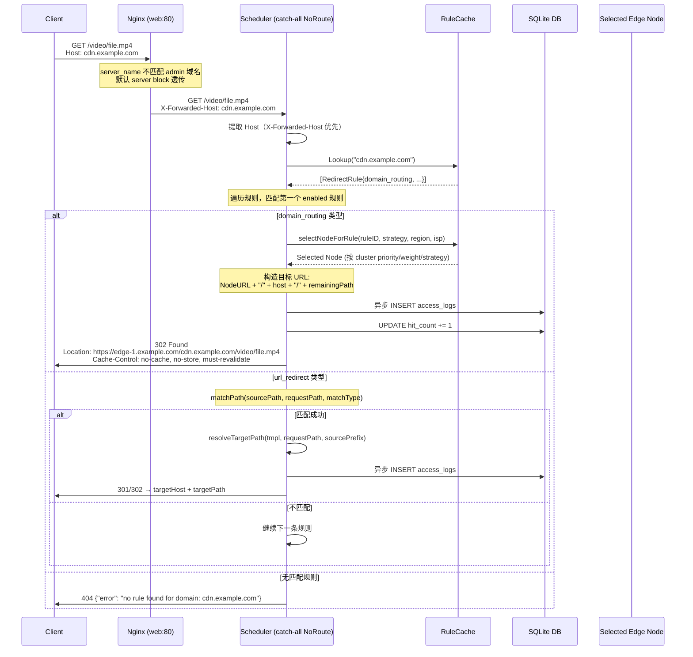
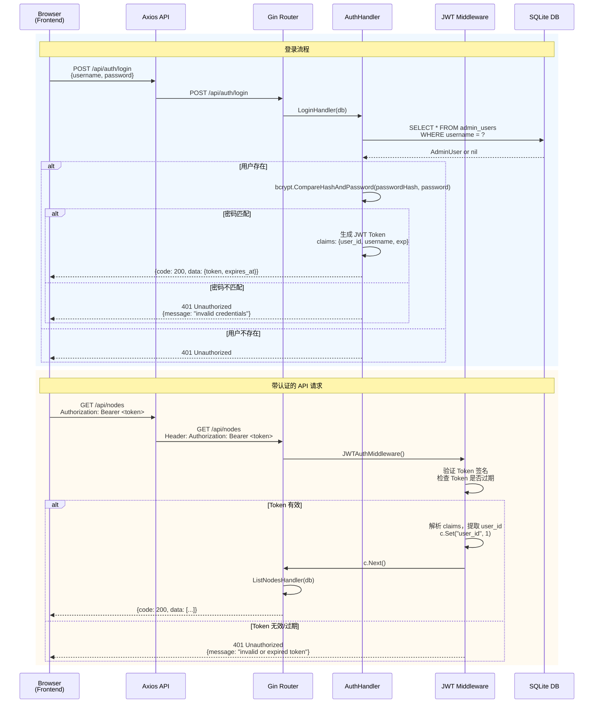
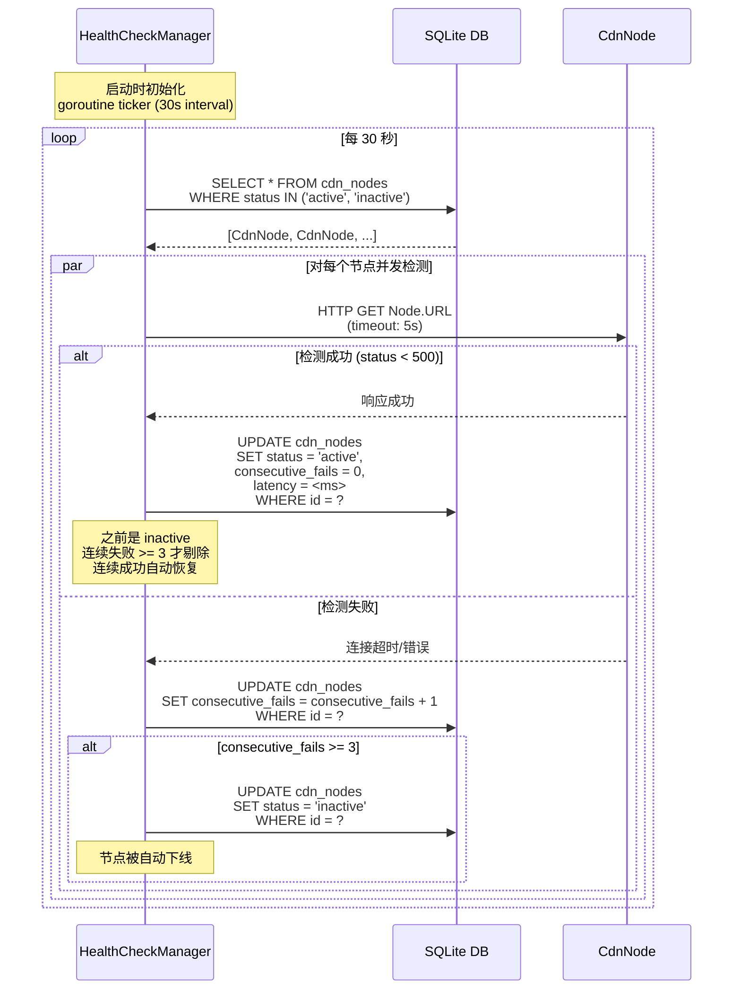
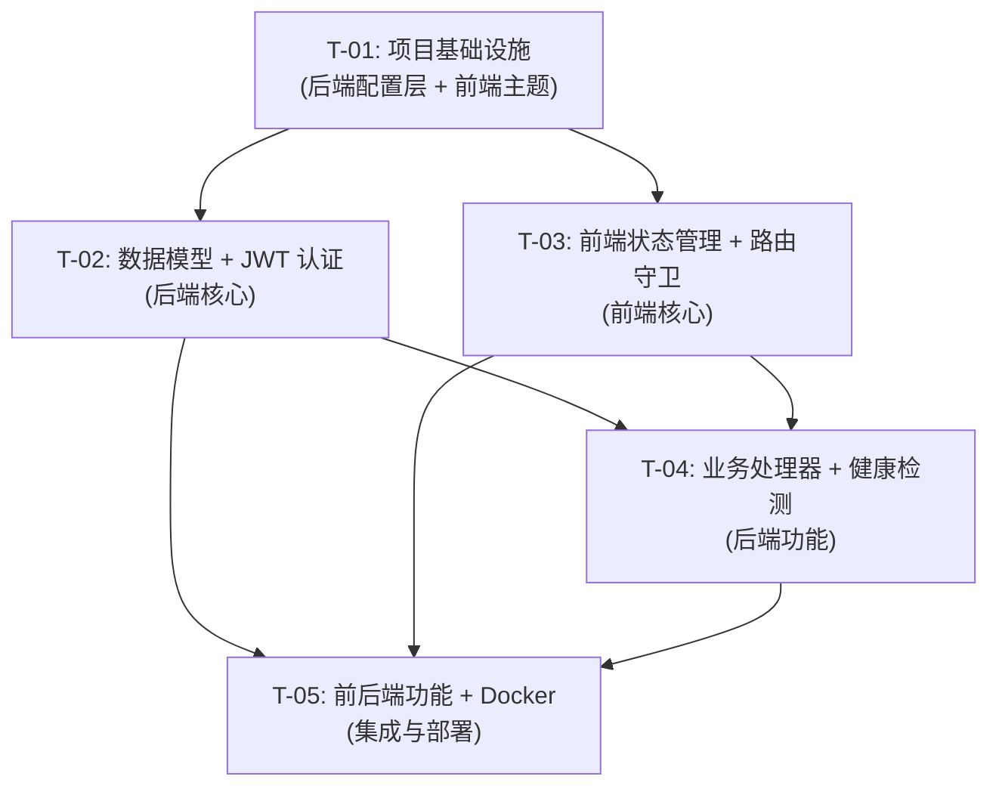

# 302CDN 管理系统 v2 增量架构设计

**版本**: v2.0
**日期**: 2026-05-13
**作者**: 高见远（架构师）

---

## 1. 实现方案概述

本次 v2 迭代针对现有 v1 系统的 5 项核心缺陷进行修复，并增加生产级功能（配置外置、自动健康检测、IP 限流、Docker 部署）和用户体验优化（暗色主题、表格增强、CSV 导出、前后端融合）。

**核心技术方案**：
- **后端**：Go 1.21 + Gin + GORM + SQLite，新增 JWT 认证、滑动窗口限流、后台健康检测 Goroutine
- **前端**：React 18 + MUI v5 + Vite，新增暗色主题切换器、本地状态管理增强
- **部署**：Docker 单文件构建，前端资源嵌入 Go 二进制

**关键设计决策**：
- JWT Token 前端存储于 localStorage
- 初始管理员通过 `config.yaml` 配置，首次启动自动创建
- IP 限流按单 IP 总请求数（滑动窗口 60 次/分钟），白名单豁免
- Domain 字段默认为空字符串（匹配所有域名）
- 本期不做告警通知，仅状态变更记录

---

## 2. 框架选型 & 新增依赖

### 2.1 后端 Go 依赖（go.mod）

```go
// 新增依赖
github.com/golang-jwt/jwt/v5 v5.2.0    // JWT 签发与验证
github.com/spf13/viper v1.18.2          // 配置管理（YAML + 环境变量）
golang.org/x/time/rate v0.5.0          // 滑动窗口限流
golang.org/x/crypto v0.18.0             // bcrypt 密码哈希

// 已有依赖（保持不变）
github.com/gin-gonic/gin v1.9.1
gorm.io/driver/sqlite v1.5.5
gorm.io/gorm v1.25.7
```

### 2.2 前端 npm 依赖（package.json）

```json
{
  "dependencies": {
    // 新增
    "@emotion/react": "^11.11.3",
    "@emotion/styled": "^11.11.0",
    "@mui/material": "^5.15.10",
    "@mui/icons-material": "^5.15.10",
    "react-router-dom": "^6.22.1",
    "recharts": "^2.12.2",
    "axios": "^1.6.7",
    "react": "^18.2.0",
    "react-dom": "^18.2.0"
  },
  "devDependencies": {
    "@vitejs/plugin-react": "^4.2.1",
    "autoprefixer": "^10.4.17",
    "postcss": "^8.4.35",
    "tailwindcss": "^3.4.1",
    "vite": "^5.1.4"
  }
}
```

**说明**：前端依赖无新增，MUI 暗色主题通过 `createTheme` 实现，无需额外包。

---

## 3. 数据模型变更

### 3.1 现有模型修改

#### 3.1.1 RedirectRule（redirect_rule.go）

```go
// RedirectRule represents a URL redirect rule with associated CDN nodes.
type RedirectRule struct {
    ID          uint      `json:"id" gorm:"primarykey"`
    Key         string    `json:"key" gorm:"uniqueIndex:idx_rule_key_domain"` // part of unique index
    Domain      string    `json:"domain" gorm:"default:'';index:idx_rule_key_domain"` // 新增：域名匹配，空字符串匹配所有
    Description string    `json:"description"`
    Strategy    string    `json:"strategy" gorm:"default:'round-robin'"`
    NodeIDs     string    `json:"node_ids"` // JSON array string
    HitCount    int64     `json:"hit_count"`
    CreatedAt   time.Time `json:"created_at"`
}
```

**变更说明**：
- 新增 `Domain` 字段，类型为 `string`，默认空字符串
- 新增联合唯一索引 `idx_rule_key_domain`（Key + Domain），确保同域名下 Key 唯一

#### 3.1.2 CdnNode（cdn_node.go）

```go
// CdnNode represents a CDN node in the system.
type CdnNode struct {
    ID              uint      `json:"id" gorm:"primarykey"`
    Name            string    `json:"name" binding:"required,min=1,max=64"`
    URL             string    `json:"url" binding:"required,url,max=512"`
    Weight          int       `json:"weight" gorm:"default:1"`
    Region          string    `json:"region"`
    Status          string    `json:"status" gorm:"default:'active'"` // active/inactive
    Latency         int       `json:"latency"`   // ms
    ConsecutiveFails int      `json:"consecutive_fails" gorm:"default:0"` // 新增：连续失败次数（健康检测用）
    CreatedAt       time.Time `json:"created_at"`
}
```

**变更说明**：
- 新增 `ConsecutiveFails` 字段，用于自动健康检测状态切换计数
- 输入校验增强：`Name` 1-64 字符，`URL` 合规 URL 格式（最多 512 字符）

#### 3.1.3 AccessLog（access_log.go，保持不变）

```go
// AccessLog represents a CDN redirect access record.
type AccessLog struct {
    ID         uint      `json:"id" gorm:"primarykey"`
    RuleKey    string    `json:"rule_key"`
    Domain     string    `json:"domain"`       // 新增：记录请求域名
    Path       string    `json:"path"`         // 新增：记录原始请求路径
    NodeID     uint      `json:"node_id"`
    NodeName   string    `json:"node_name"`
    TargetURL  string    `json:"target_url"`
    ClientIP   string    `json:"client_ip"`
    UserAgent  string    `json:"user_agent"`
    StatusCode int       `json:"status_code"`
    CreatedAt  time.Time `json:"created_at"`
}
```

**变更说明**：
- 新增 `Domain` 字段，记录请求域名
- 新增 `Path` 字段，记录原始请求路径（透传部分）

### 3.2 新增模型

#### 3.2.1 AdminUser（admin_user.go）

```go
// AdminUser represents an administrator account.
type AdminUser struct {
    ID           uint      `json:"id" gorm:"primarykey"`
    Username     string    `json:"username" gorm:"uniqueIndex;size:64;not null"`
    PasswordHash string    `json:"-" gorm:"size:255;not null"` // bcrypt hash, never expose
    CreatedAt    time.Time `json:"created_at"`
    UpdatedAt    time.Time `json:"updated_at"`
}
```

**说明**：
- `PasswordHash` 使用 `golem.org/x/crypto/bcrypt` 加密存储
- JSON 序列化时排除密码字段（`json:"-"`）

---

## 4. API 变更清单

### 4.1 新增 API

#### 4.1.1 认证相关

| 方法 | 路径 | 描述 | 认证 |
|------|------|------|------|
| POST | `/api/auth/login` | 管理员登录，返回 JWT Token | 否 |
| POST | `/api/auth/logout` | 登出（前端清除 Token） | 是 |

**POST /api/auth/login 请求体**：
```json
{
  "username": "admin",
  "password": "your-password"
}
```

**响应（200 OK）**：
```json
{
  "code": 200,
  "data": {
    "token": "eyJhbGciOiJIUzI1NiIsInR5cCI6IkpXVCJ9...",
    "expires_at": "2026-05-14T12:00:00Z"
  },
  "message": "login success"
}
```

**错误响应（401 Unauthorized）**：
```json
{
  "code": 401,
  "data": null,
  "message": "invalid username or password"
}
```

#### 4.1.2 配置相关（新增）

| 方法 | 路径 | 描述 | 认证 |
|------|------|------|------|
| GET | `/api/config/health-check` | 获取健康检测配置状态 | 是 |
| POST | `/api/config/health-check/toggle` | 手动触发健康检测（调试用） | 是 |

### 4.2 现有 API 变更

#### 4.2.1 节点管理（`/api/nodes/*`）

- **POST /api/nodes**：
  - 请求体增加校验：`name` 1-64 字符，`url` 合规 URL，`weight` 1-100
  - 响应增加 `consecutive_fails` 字段

- **PUT /api/nodes/:id**：
  - 同上输入校验增强

#### 4.2.2 规则管理（`/api/rules/*`）

- **POST /api/rules**：
  - 请求体新增 `domain` 字段（可选，默认为空字符串）
  - `key` 字段校验：`^[a-z0-9-]{3,64}$`（小写字母、数字、连字符，3-64 字符）

- **PUT /api/rules/:id**：
  - 同上，`key` 不可修改（编辑时不允许更改）
  - 新增 `domain` 字段支持

#### 4.2.3 统计 API（`/api/stats/*`）

- **GET /api/stats/overview**：
  - 响应新增 `health_check_status` 字段（`running`/`stopped`）

### 4.3 认证保护范围

| 路径模式 | 保护状态 | 说明 |
|----------|----------|------|
| `/*` (scheduler 全路径匹配) | 否 | 基于 Host 头匹配规则，302 跳转公开访问 |
| `GET /api/stats/overview` | 是 | 需要 JWT |
| `GET /api/nodes` | 是 | 需要 JWT |
| `POST /api/auth/login` | 否 | 登录接口公开 |

### 4.4 限流响应

**429 Too Many Requests**：
```json
{
  "code": 429,
  "data": null,
  "message": "rate limit exceeded, please try again later"
}
```

响应头：
```
Retry-After: 60
X-RateLimit-Limit: 60
X-RateLimit-Remaining: 0
X-RateLimit-Reset: 1715688000
```

---

## 5. 程序调用流程

### 5.1 基于 Host 头匹配 + 集群调度的 302 跳转流程

```
用户请求入口：
  管理员域名（如 admin.veer.local）→ nginx → manager:8080（前端 + API）
  CDN 域名（如 cdn.example.com） → nginx → scheduler:8081（302 调度）
                             （默认 server block 捕获未知域名）
```



### 5.2 JWT 登录 + 请求认证流程



### 5.3 自动健康检测流程（后台 Goroutine）



---

## 6. 配置文件设计

### 6.1 config.yaml 完整结构

```yaml
# 302CDN v2 配置文件
# 支持环境变量覆盖，格式: CDNC_开头的环境变量会覆盖对应字段

server:
  # 服务监听地址（支持环境变量: CDNC_SERVER_HOST）
  host: "0.0.0.0"
  # 服务监听端口（支持环境变量: CDNC_SERVER_PORT）
  port: 8080
  # 前端静态文件嵌入路径（可选，不设置则不嵌入）
  # embed_frontend: "./dist"

database:
  # SQLite 数据库文件路径（支持环境变量: CDNC_DB_PATH）
  path: "./veer.db"

jwt:
  # JWT 签名密钥（支持环境变量: CDNC_JWT_SECRET）
  # 生产环境务必通过环境变量设置！
  secret: "your-256-bit-secret-key-here"
  # Token 过期时间（支持环境变量: CDNC_JWT_EXPIRY）
  expiry_hours: 24

admin:
  # 初始管理员账户（仅在用户不存在时创建）
  # 密码建议通过环境变量设置（支持环境变量: CDNC_ADMIN_PASSWORD）
  username: "admin"
  # 初始密码（首次启动后请立即修改！）
  # 支持环境变量: CDNC_ADMIN_PASSWORD
  password: "admin123"

health_check:
  # 是否启用自动健康检测
  enabled: true
  # 检测间隔（秒）
  interval_seconds: 30
  # 连续失败次数阈值（达到后节点自动下线）
  fail_threshold: 3
  # 单次检测超时（秒）
  timeout_seconds: 5

rate_limit:
  # 是否启用 IP 限流
  enabled: true
  # 滑动窗口内最大请求数
  requests_per_minute: 60
  # 白名单 IP 列表（不受限流限制）
  whitelist:
    - "127.0.0.1"
    - "::1"
    # - "10.0.0.0/8"
```

### 6.2 环境变量覆盖规则

| 环境变量 | 对应配置路径 | 说明 |
|----------|--------------|------|
| `CDNC_SERVER_HOST` | `server.host` | 服务监听地址 |
| `CDNC_SERVER_PORT` | `server.port` | 服务监听端口 |
| `CDNC_DB_PATH` | `database.path` | 数据库文件路径 |
| `CDNC_JWT_SECRET` | `jwt.secret` | JWT 签名密钥 |
| `CDNC_JWT_EXPIRY` | `jwt.expiry_hours` | Token 过期小时数 |
| `CDNC_ADMIN_PASSWORD` | `admin.password` | 初始管理员密码 |

**优先级**：`环境变量 > config.yaml > 默认值`

---

## 7. 任务列表

### 任务依赖图



### T-01: 项目基础设施（配置层 + 前端主题）

**涉及文件**：
```
backend/
├── config/config.go          # 重写：Viper 配置加载
├── config/types.go           # 新增：配置结构体定义
├── middleware/ratelimit.go   # 新增：IP 限流中间件
├── middleware/auth.go        # 新增：JWT 中间件
└── go.mod                    # 修改：新增依赖

frontend/src/
├── theme.js                  # 修改：新增暗色主题工厂函数
└── theme-dark.js             # 新增：暗色主题配置
```

**任务描述**：
1. **后端配置层**：
   - 新增 `config/types.go`，定义所有配置结构体（ServerConfig, JWTConfig, AdminConfig, HealthCheckConfig, RateLimitConfig）
   - 重写 `config/config.go`，使用 Viper 实现 YAML 配置加载 + 环境变量覆盖
   - 添加首次启动自动创建管理员逻辑（检查 admin_users 表是否为空）

2. **后端中间件**：
   - 新增 `middleware/auth.go`：JWT 签发、验证中间件
   - 新增 `middleware/ratelimit.go`：滑动窗口 IP 限流实现（使用 golang.org/x/time/rate）

3. **前端主题**：
   - 重构 `theme.js`：将 `createTheme` 提取为可配置函数
   - 新增 `theme-dark.js`：暗色主题配置（palette.mode = 'dark'）

**依赖**：无
**优先级**：P0
**预估复杂度**：M

---

### T-02: 数据模型 + JWT 认证（后端核心）

**涉及文件**：
```
backend/
├── models/
│   ├── redirect_rule.go      # 修改：新增 Domain 字段
│   ├── cdn_node.go           # 修改：新增 ConsecutiveFails 字段
│   ├── access_log.go         # 修改：新增 Domain、Path 字段
│   └── admin_user.go         # 新增：AdminUser 模型
├── handlers/
│   ├── auth.go               # 新增：登录/登出处理器
│   └── redirect.go          # 修改：域名匹配 + 路径透传
├── main.go                   # 修改：Viper 初始化 + 健康检测启动
└── router/router.go          # 修改：JWT 中间件注册 + 路由调整
```

**任务描述**：
1. **数据模型**：
   - 修改 `redirect_rule.go`：新增 `Domain` 字段 + 联合唯一索引
   - 修改 `cdn_node.go`：新增 `ConsecutiveFails` 字段
   - 修改 `access_log.go`：新增 `Domain`、`Path` 字段
   - 新增 `admin_user.go`：AdminUser 模型定义

2. **认证处理器**：
   - 新增 `handlers/auth.go`：
     - `LoginHandler`：验证用户名密码，签发 JWT Token（24h 有效期）
     - `LogoutHandler`：前端清除 Token，后端无状态

3. **RedirectHandler 增强**：
   - 路由改为 `GET /r/:ruleKey/*path`（支持路径透传）
   - 查询规则时优先精确匹配 Domain，其次匹配空 Domain
   - 目标 URL 拼接：`NodeURL + "/" + path`（去除重复斜杠）
   - 设置响应头：`Cache-Control: no-cache, no-store, must-revalidate` + `Vary: Host`

4. **路由调整**：
   - `/api/auth/*` 不受 JWT 保护
   - `/api/*`（除 `/api/auth/*`）均需 JWT 认证
   - `/r/*` 公开访问，不限流

**依赖**：T-01
**优先级**：P0
**预估复杂度**：L

---

### T-03: 前端状态管理 + 路由守卫（前端核心）

**涉及文件**：
```
frontend/src/
├── api/index.js              # 修改：Axios 拦截器（Token + 401 重定向）
├── api/auth.js                # 新增：认证 API
├── context/
│   ├── AuthContext.jsx        # 新增：认证状态上下文
│   └── ThemeContext.jsx       # 新增：主题切换上下文
├── components/
│   └── ProtectedRoute.jsx     # 新增：路由守卫组件
├── pages/
│   └── Login.jsx              # 新增：登录页面
├── App.jsx                    # 修改：路由守卫集成
└── main.jsx                  # 修改：Context Provider 包装
```

**任务描述**：
1. **认证 API 层**：
   - 新增 `api/auth.js`：`login(username, password)`、`logout()`
   - 修改 `api/index.js`：
     - 请求拦截器：从 localStorage 读取 Token，附加到 `Authorization` 头
     - 响应拦截器：401 时清除 Token 并跳转登录页

2. **认证状态管理**：
   - 新增 `context/AuthContext.jsx`：提供 `user`、`login`、`logout`、`isAuthenticated`
   - 使用 React Context + localStorage 实现持久化

3. **主题状态管理**：
   - 新增 `context/ThemeContext.jsx`：提供 `mode`、`toggleTheme`
   - localStorage 持久化（key: `veer-theme`）

4. **路由守卫**：
   - 新增 `components/ProtectedRoute.jsx`：未登录用户重定向到 `/login`

5. **登录页面**：
   - 新增 `pages/Login.jsx`：用户名/密码表单，调用认证 API

6. **入口调整**：
   - `main.jsx`：用 `AuthProvider`、`ThemeProvider`、`ThemeProvider` 包装
   - `App.jsx`：添加 `/login` 路由和 `ProtectedRoute` 包装

**依赖**：T-01
**优先级**：P0
**预估复杂度**：M

---

### T-04: 业务处理器 + 健康检测（后端功能）

**涉及文件**：
```
backend/
├── handlers/
│   ├── nodes.go              # 修改：输入校验增强 + 响应字段调整
│   ├── rules.go              # 修改：输入校验增强 + Domain 字段支持
│   ├── stats.go              # 修改：新增健康检测状态
│   └── health_check.go       # 新增：自动健康检测管理器
├── services/
│   └── health_check.go       # 新增：健康检测逻辑
├── config/
│   └── health_check.go       # 新增：健康检测配置读取
└── main.go                   # 修改：启动健康检测 Goroutine
```

**任务描述**：
1. **输入校验增强**：
   - `nodes.go`：`Name` 1-64 字符，`URL` 合规 URL 格式，`Weight` 1-100
   - `rules.go`：`Key` 正则 `^[a-z0-9-]{3,64}$`，`Domain` 可选（默认空字符串）

2. **健康检测服务**：
   - 新增 `services/health_check.go`：
     - `HealthCheckManager` 结构体：Ticker、DB 引用、运行状态
     - `Start()`：启动 Goroutine，定期检测所有节点
     - `Stop()`：优雅停止
     - `CheckNode(node)`：HTTP GET + 超时检测 + 状态更新
   - 逻辑：失败连续 3 次自动 `inactive`，成功自动恢复 `active`

3. **健康检测配置**：
   - 新增 `config/health_check.go`：读取 Viper 配置
   - `main.go`：根据配置决定是否启动健康检测 Goroutine

4. **统计 API 增强**：
   - `stats.go`：`GetOverview` 响应新增 `health_check_status`

**依赖**：T-02
**优先级**：P1
**预估复杂度**：M

---

### T-05: 前后端功能 + Docker（集成与部署）

**涉及文件**：
```
backend/
├── main.go                    # 修改：Vite 代理配置嵌入 + 前端资源嵌入
├── handlers/
│   └── stats.go              # 修改：新增 CSV 导出端点
├── frontend/src/
│   ├── pages/
│   │   ├── Nodes.jsx         # 修改：表格排序/搜索/批量操作
│   │   ├── Rules.jsx         # 修改：表格排序/搜索/批量操作
│   │   └── Logs.jsx          # 修改：CSV 导出按钮
│   ├── components/
│   │   ├── Layout.jsx        # 修改：暗色主题切换按钮 + 用户信息
│   │   └── DataTable.jsx     # 新增：可复用表格组件（排序/搜索）
│   ├── hooks/
│   │   └── useTableSearch.js  # 新增：前端搜索/排序 Hook
│   └── utils/
│       └── csv.js            # 新增：CSV 导出工具函数
├── Dockerfile                # 新增：构建镜像
├── docker-compose.yml        # 新增：本地开发编排
└── .dockerignore             # 新增：Docker 构建排除

frontend/
├── vite.config.js            # 修改：代理配置
└── package.json               # 修改（无新增依赖）
```

**任务描述**：
1. **前端表格增强**：
   - 新增 `hooks/useTableSearch.js`：通用搜索/排序逻辑 Hook
   - 修改 `pages/Nodes.jsx`：
     - 表格列排序（Name、Region、Weight、Status、Latency）
     - 搜索框（名称/URL 模糊匹配）
     - 复选框批量选择 + 批量删除
   - 修改 `pages/Rules.jsx`：同上（Key、Description、Strategy 排序/搜索）

2. **CSV 导出**：
   - 新增 `utils/csv.js`：`exportToCSV(data, filename)` 函数，添加 UTF-8 BOM
   - 修改 `pages/Logs.jsx`：添加导出按钮，导出当前筛选数据

3. **暗色主题切换**：
   - 修改 `components/Layout.jsx`：
     - AppBar 添加主题切换图标按钮
     - 显示当前用户信息（从 AuthContext）
     - 添加登出按钮

4. **Docker 部署**：
   - 新增 `Dockerfile`：多阶段构建（前端构建 + 后端编译 + 资源嵌入）
   - 新增 `docker-compose.yml`：定义服务、端口映射、数据卷
   - 新增 `.dockerignore`：排除 node_modules、.git 等

5. **前端嵌入后端（可选 P2-004）**：
   - `main.go`：使用 `embed.FS` 嵌入前端构建产物
   - 添加 `/static/*` 路由提供静态文件
   - 生产环境单二进制部署

**依赖**：T-03、T-04
**优先级**：P2（表格增强）/ P1（Docker）/ P2（前端嵌入）
**预估复杂度**：L

---

## 8. 文件清单

### 8.1 后端文件变更

| 文件路径 | 操作 | 说明 |
|----------|------|------|
| `backend/go.mod` | 修改 | 新增 JWT、viper、bcrypt 依赖 |
| `backend/main.go` | 修改 | Viper 初始化、HealthCheck 启动 |
| `backend/config/types.go` | 新增 | 配置结构体定义 |
| `backend/config/config.go` | 修改 | Viper YAML 加载逻辑 |
| `backend/models/redirect_rule.go` | 修改 | Domain 字段、联合索引 |
| `backend/models/cdn_node.go` | 修改 | ConsecutiveFails 字段 |
| `backend/models/access_log.go` | 修改 | Domain、Path 字段 |
| `backend/models/admin_user.go` | 新增 | AdminUser 模型 |
| `backend/handlers/auth.go` | 新增 | 登录/登出处理器 |
| `backend/handlers/redirect.go` | 修改 | 域名匹配、路径透传 |
| `backend/handlers/nodes.go` | 修改 | 输入校验增强 |
| `backend/handlers/rules.go` | 修改 | 输入校验、Domain 支持 |
| `backend/handlers/stats.go` | 修改 | 健康检测状态 |
| `backend/handlers/health_check.go` | 新增 | 健康检测 HTTP 端点 |
| `backend/services/health_check.go` | 新增 | 健康检测核心逻辑 |
| `backend/middleware/auth.go` | 新增 | JWT 中间件 |
| `backend/middleware/ratelimit.go` | 新增 | IP 限流中间件 |
| `backend/router/router.go` | 修改 | JWT 中间件注册 |

### 8.2 前端文件变更

| 文件路径 | 操作 | 说明 |
|----------|------|------|
| `frontend/src/api/auth.js` | 新增 | 认证 API |
| `frontend/src/api/index.js` | 修改 | Token 拦截器、401 处理 |
| `frontend/src/context/AuthContext.jsx` | 新增 | 认证状态管理 |
| `frontend/src/context/ThemeContext.jsx` | 新增 | 主题状态管理 |
| `frontend/src/components/ProtectedRoute.jsx` | 新增 | 路由守卫 |
| `frontend/src/components/Layout.jsx` | 修改 | 主题切换、用户信息 |
| `frontend/src/pages/Login.jsx` | 新增 | 登录页面 |
| `frontend/src/pages/Nodes.jsx` | 修改 | 排序/搜索/批量操作 |
| `frontend/src/pages/Rules.jsx` | 修改 | 排序/搜索/批量操作 |
| `frontend/src/pages/Logs.jsx` | 修改 | CSV 导出 |
| `frontend/src/hooks/useTableSearch.js` | 新增 | 表格搜索排序 Hook |
| `frontend/src/utils/csv.js` | 新增 | CSV 导出工具 |
| `frontend/src/theme.js` | 修改 | 主题工厂函数 |
| `frontend/src/theme-dark.js` | 新增 | 暗色主题配置 |
| `frontend/src/App.jsx` | 修改 | 路由守卫集成 |
| `frontend/src/main.jsx` | 修改 | Context Provider |

### 8.3 部署文件

| 文件路径 | 操作 | 说明 |
|----------|------|------|
| `backend/Dockerfile` | 新增 | 容器镜像构建 |
| `backend/docker-compose.yml` | 新增 | 本地开发编排 |
| `backend/.dockerignore` | 新增 | Docker 排除规则 |

---

## 9. 共享知识

### 9.1 API 响应格式

所有 API 响应统一使用以下格式：

```json
{
  "code": 200,
  "data": {},
  "message": "success"
}
```

| HTTP Status | code | 说明 |
|-------------|------|------|
| 200 OK | 200 | 请求成功 |
| 201 Created | 201 | 资源创建成功 |
| 400 Bad Request | 400 | 请求参数错误 |
| 401 Unauthorized | 401 | 未认证或 Token 过期 |
| 403 Forbidden | 403 | 无权限访问 |
| 404 Not Found | 404 | 资源不存在 |
| 429 Too Many Requests | 429 | 限流触发 |
| 500 Internal Server Error | 500 | 服务器内部错误 |

### 9.2 JWT Token 规范

- **存储位置**：前端 `localStorage`（key: `veer_token`）
- **Header 格式**：`Authorization: Bearer <token>`
- **Payload 字段**：
  ```json
  {
    "user_id": 1,
    "username": "admin",
    "exp": 1715688000,
    "iat": 1715601600
  }
  ```
- **过期时间**：24 小时（可配置）
- **续期策略**：前端检测 401 后引导用户重新登录

### 9.3 限流策略

- **算法**：滑动窗口（Sliding Window）
- **窗口大小**：60 秒
- **最大请求数**：60 次/窗口
- **白名单**：127.0.0.1、::1（IPv6 localhost）
- **触发响应**：HTTP 429 + `Retry-After` 头

### 9.4 健康检测策略

- **检测间隔**：30 秒（可配置）
- **超时时间**：5 秒
- **失败阈值**：连续 3 次失败自动下线
- **恢复条件**：1 次成功即恢复（需满足之前被下线）

### 9.5 输入校验规则

| 字段 | 规则 | 正则/范围 |
|------|------|-----------|
| `rule.key` | 小写字母、数字、连字符，3-64 字符 | `^[a-z0-9-]{3,64}$` |
| `rule.domain` | 可选，默认空字符串 | 最大 253 字符 |
| `node.name` | 1-64 字符 | - |
| `node.url` | 合规 URL | RFC 3986 |
| `node.weight` | 1-100 | - |
| `admin.username` | 唯一，3-32 字符 | `^[a-zA-Z0-9_]{3,32}$` |
| `admin.password` | 最少 8 字符 | - |

---

## 10. 不确定事项

以下事项已在 PRD 中明确决策，无需额外确认：

| 编号 | 问题 | 决策 |
|------|------|------|
| Q1 | JWT Token 存储 | localStorage（前端） |
| Q2 | 初始管理员创建 | 配置文件指定，首次启动自动创建 |
| Q3 | 限流粒度 | 单 IP 总请求数 |
| Q4 | 告警通知 | 本期不做，仅状态变更 |
| Q5 | Domain 默认值 | 空字符串（匹配所有） |
| Q6 | Docker 仓库 | 只提供 Dockerfile，不推仓库 |
| Q7 | 敏感配置 | 环境变量覆盖 YAML |
| Q8 | 灰度发布 | 本期不做 |

---

**文档版本**：v2.0
**最后更新**：2026-05-13
**审核状态**：待评审
